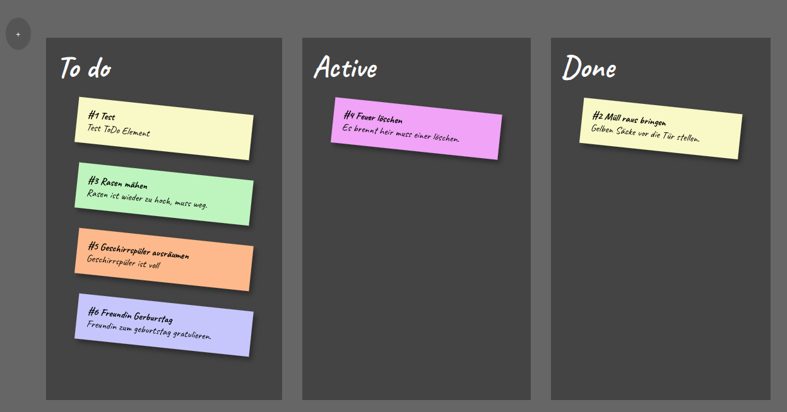

# OSWC-Semesteraufgabe

## Description
Our semester assignment for the Operating Systems and Web Computing module. It is a minimalistic Kanban webapp.
The saving is done in a SQLite database. The output is created by a CGI Python script.

## Install
Use git and docker to create this project.

1. Clone the repo: `git clone https://github.com/tnutzmann/OSWC-Semesteraufgabe.git`
2. Switch to the directory: `cd OSWC-Semesteraufgabe`
3. Build the docker: `sudo docker build -t cgi .`
4. Run the application: `sudo docker run -dit -p 8080:80 cgi`
5. Now open in browser: `firefox http://localhost:8080/cgi/index.cgi`

## Unittests
In the repo folder:: `python3 -m tests.test_todo_database`

## URL PATHS
 - Create: `/cgi/index.cgi?title=foo&content=bar&color=green&action=create`
 - Delete: `/cgi/index.cgi?id=3&action=delete`
 - Shift: `/cgi/index.cgi?id=5&action=shift`

## Authors
- [Sebastian Feustel 20224832](https://github.com/53845714nF)
- [Tony Nutzmann ](https://github.com/tnutzmann)